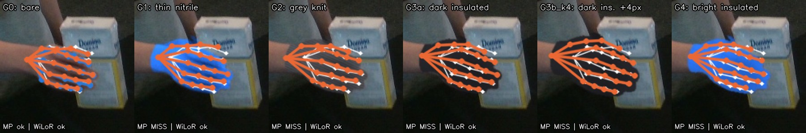
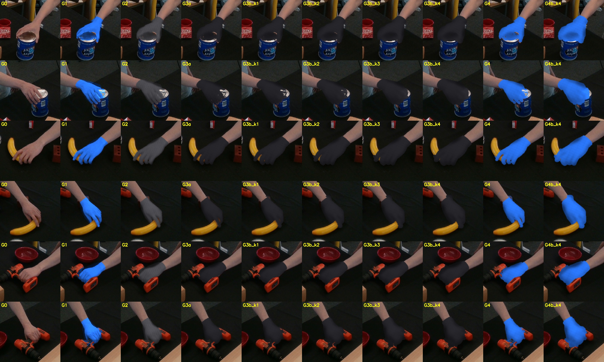
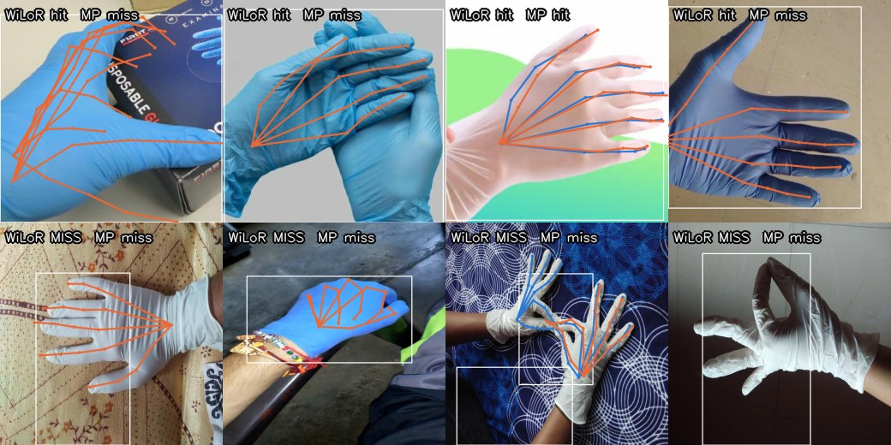
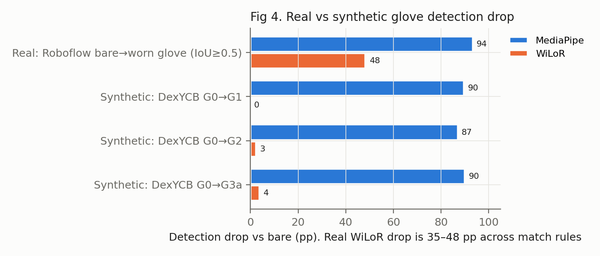
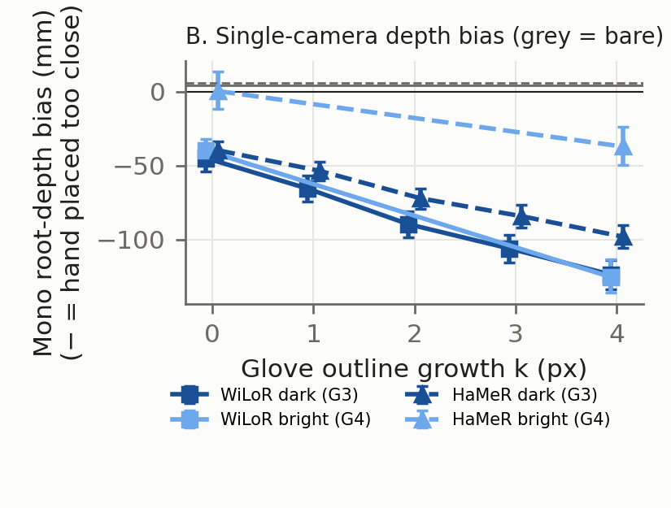
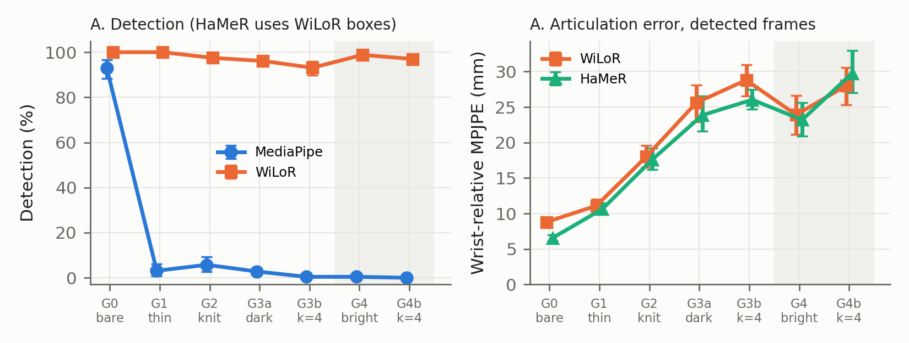
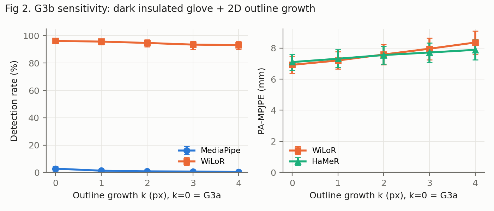
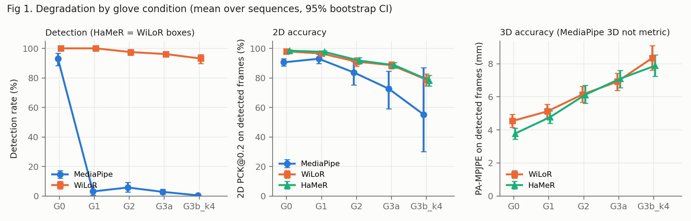
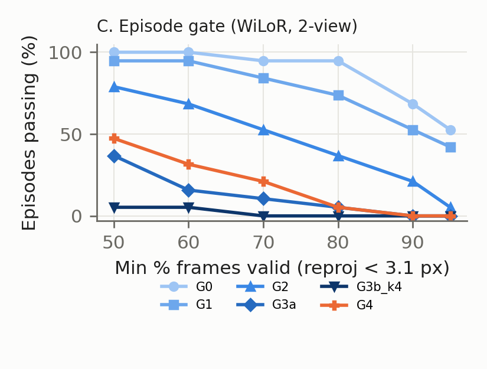
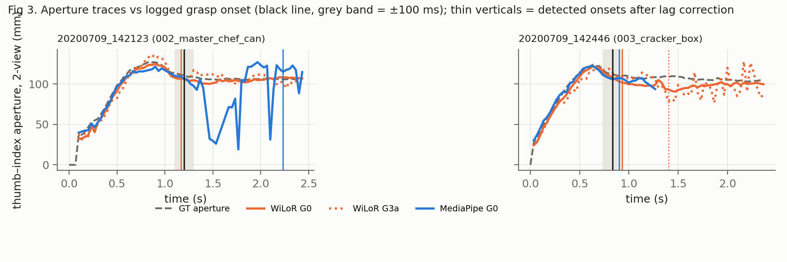

# glove-gap

**What happens to 3D hand-pose estimation, the front end of human-video → robot-policy
pipelines, when every operator wears work gloves? And which capture choices fix it?**

📄 One-page report: [`report/glove_gap.pdf`](report/glove_gap.pdf) ·
🔁 `make all` reproduces every number from cached predictions


<sub>One held-out DexYCB frame with synthetic gloves G0–G4. MediaPipe (blue) loses the hand as
soon as any glove goes on. WiLoR (orange) still finds it, but its finger pose drifts from ground
truth (white) as gloves get darker and thicker.</sub>

## TL;DR

| # | Finding | Key number |
|---|---|---|
| **a** | **Real gloves break hand detection. Synthetic gloves underestimate how much.** | Real worn gloves: WiLoR finds **52–65%** (bare: 100%), MediaPipe **7–13%**. Synthetic gloves: WiLoR loses only 0–4 pp. |
| **b** | **Gloves bias single-camera depth.** Bigger-looking hands are read as closer. | Hand placed **45 mm** too close (dark insulated), up to **124 mm** with a thicker outline |
| **c** | **Extra cameras fix hand *position*, not *finger pose*.** Only a thinner glove fixes finger pose. | 2 views remove **72–88%** of the position error but **≤49%** of the finger error; thin nitrile removes **73–92%** |
| **d** | **A reprojection check flags gloved *batches*, not bad *episodes*.** | Episodes passing: **95%** bare → 37% knit → **5%** insulated |

**What to put in a capture spec:**

| | Spec | Why |
|---|---|---|
| Pose model | ViT/MANO class (WiLoR, HaMeR), **not MediaPipe** | MediaPipe detection 93% → ≤6% with any glove |
| Glove | **Thin, form-fitting nitrile**; colour matters little | Thin glove: +0.6 mm pose error vs bare. Insulated: +2.4 mm, and finger error ×2.9. A *bright* insulated glove is no better than a dark one |
| Thickness | Minimise | Each px of extra outline adds ≈ +0.4 mm pose error and −20 mm depth bias |
| Cameras | **≥2 calibrated views**, ~1 m apart at ~70° (or RGB-D) for position | Dark glove: 14.6 mm (2 views) vs 48.8 mm (1 view) |
| QA gate | Per capture batch: reprojection < 3.1 px on ≥80% of frames; investigate below ~75% pass | 95% of bare episodes pass vs 5% insulated |

**Caveats:** synthetic gloves · one subject, lab objects · the models may have seen this
dataset's subject in training, so trust the *relative* drop, not absolute accuracy · the
real-glove check is detection-only on 83 photos. [Full limits ↓](#limits)

---

## How it was tested (30-second version)

- **Data:** [DexYCB](https://dex-ycb.github.io/), 19 held-out grasp sequences, 8 synced cameras,
  ground-truth 3D joints. Main rig: 2 cameras (1.03 m apart, 70°).
- **Gloves:** painted onto the hand pixels. The original shading is kept and the skeleton never
  moves.

  | Code | Glove |
  |---|---|
  | G0 | bare |
  | G1 | thin bright nitrile |
  | G2 | grey knit |
  | G3a | dark insulated |
  | G3b | G3a + outline grown 1–4 px (thickness) |
  | G4 | bright insulated (colour control) |
- **Models:** MediaPipe Hands, WiLoR, HaMeR. HaMeR uses WiLoR's hand boxes.
- **Real-glove check:** 83 public photos of bare and gloved hands (Roboflow).
- **Stats:** every number is a mean over sequences with a 95% bootstrap CI over sequences.

<details><summary><b>All glove conditions on 3 sequences × 2 cameras</b></summary>


</details>

---

## a · Real gloves break detection; synthetic gloves underestimate it


<sub>Real worn-glove photos. White = annotated box, orange = WiLoR, blue = MediaPipe. Top row:
first 4 WiLoR hits by image id. Bottom row: first 4 misses. MediaPipe rarely produces a
skeleton at all. Several WiLoR "misses" do have a skeleton, but fail strict box matching
because glove boxes include the cuff.</sub>

| Recall on real photos (Wilson 95% CI) | Bare (n=37) | Worn glove (n=31) |
|---|---|---|
| MediaPipe | 100% [91–100] | **7–13%** |
| WiLoR | 100% [91–100] | **52–65%** |

- **The range comes from the match rule:**

  | Match rule | WiLoR | MediaPipe |
  |---|---|---|
  | IoU ≥ 0.5 | 52% [35–68] | 7% |
  | IoU ≥ 0.3 | 61% | 13% |
  | ≥ 50% of the prediction inside the GT box | 65% [47–79] | 13% |
- **Box size doesn't explain the drop away.** Glove photos are mostly close-ups. At IoU ≥ 0.5,
  WiLoR finds 1/8 small, 0/5 medium and 15/18 large gloves. Re-weighted to the bare photos' size
  mix, its glove recall is only 0.16. Per-bin n is small.
- **Cropping doesn't rescue MediaPipe.** Run on WiLoR's crops, its glove recall stays at 7%.
  (Its palm detector still runs on the crop.)



**Takeaway:**
- Synthetic gloves **match reality for MediaPipe** (−87 to −90 pp synthetic vs −94 pp real).
- They **underestimate it for WiLoR** (−0 to −4 pp synthetic vs −35 to −48 pp real).
- Treat WiLoR's synthetic detection rates as optimistic. Pose errors below are measured on
  frames where a hand *was* detected.

## b · Gloves bias single-camera depth



- One camera infers depth from apparent hand size, so a glove that changes that size moves the
  hand. Bias of monocular WiLoR's wrist depth vs GT:

  | Glove | G0 bare | G1 thin | G2 knit | G3a dark ins. | G3b k=4 | G4 bright ins. |
  |---|---|---|---|---|---|---|
  | Depth bias | +4 mm | +41 mm | −28 mm | −45 mm | −124 mm | −41 mm |

  Negative = hand placed too close. Each px of outline growth adds about −20 mm.
- A bright colour removes it for HaMeR but not WiLoR, so it depends on the model. Don't rely
  on it.
- **Rule: never take hand position from a single RGB camera when operators wear gloves.** Use
  depth or ≥2 calibrated views.

## c · Extra cameras fix position, not finger pose; the glove does



**Gap reduction** = the share of the single-camera glove degradation that a fix removes.
- 100% = the glove no longer hurts.
- Mean over 19 sequences [95% CI]. Full table: [`report/recovery.md`](report/recovery.md).

| Fix (vs single camera) | Hand position | Finger pose (wrist-relative) |
|---|---|---|
| 2 calibrated views (WiLoR) | **72–88%** | 3–49% |
| 2 calibrated views (HaMeR) | **72–86%** | 6–49% |
| 8 views (WiLoR) | 83–93% | – |
| 2 views + One-Euro smoothing | ≈ 2 views; jitter −14 to −25% | ≈ 2 views |
| **Thin nitrile (G1) instead of the work glove** | 67–87% | **73–92%** |

- **Thinness, not colour, is what helps.** Paired deltas vs the dark insulated glove (G3a),
  95% CI:

  | Comparison | Detection | Finger pose | Position |
  |---|---|---|---|
  | G4: same insulated glove, but bright | +3 pp | unchanged (−1.7 mm [−3.6, +0.1]) | slightly worse |
  | G1 vs G4: thin vs insulated, same colour | – | thin is 12.8 mm better | – |
- **For finger pose, one camera's hand model beats 2-view triangulation.** At G0: 8.8 vs
  12.3 mm. A hybrid (triangulated wrist + monocular fingers) is best bare (7.6 mm) but just as
  glove-sensitive.

<details><summary><b>Full results table (all conditions × models, 95% CIs)</b></summary>

Mean over 19 sequences [95% CI], on detected frames. `(n=…)` marks cells resting on fewer
sequences, because MediaPipe rarely detects gloves. Source: [`report/results.csv`](report/results.csv).

| Condition | MP det % | WiLoR det % | MP PCK@0.2 % | WiLoR PA-MPJPE mm | HaMeR PA-MPJPE mm | WiLoR MPJPE(rel) mm | 2-view MPJPE MP / WiLoR / HaMeR mm |
|---|---|---|---|---|---|---|---|
| G0 | 93 [88–97] | 100 [100–100] | 91 [88–93] | 4.5 [4.1–4.9] | 3.8 [3.4–4.1] | 8.8 [8.2–9.4] | 15.8 [13.7–18.0] / 9.4 [8.7–10.1] / 8.7 [8.0–9.6] |
| G1 | 3 [1–6] | 100 [100–100] | 93 [90–96] (n=7) | 5.1 [4.7–5.6] | 4.8 [4.4–5.2] | 11.1 [10.2–12.0] | 14.0 [10.5–16.7] (n=3) / 10.8 [10.0–11.5] / 9.7 [9.0–10.4] |
| G2 | 6 [3–9] | 97 [95–99] | 84 [75–91] (n=14) | 6.1 [5.7–6.6] | 6.1 [5.6–6.7] | 18.0 [16.5–19.6] | 11.2 [9.6–12.8] (n=3) / 13.6 [12.3–15.1] / 13.5 [12.5–14.7] |
| G3a | 3 [1–4] | 96 [94–98] | 73 [59–85] (n=12) | 6.9 [6.4–7.4] | 7.1 [6.6–7.6] | 25.6 [22.9–28.1] | 15.2 [15.2–15.2] (n=1) / 14.6 [13.4–15.9] / 14.7 [13.6–15.9] |
| G3b_k1 | 1 [0–2] | 96 [93–98] | 79 [62–90] (n=6) | 7.2 [6.7–7.8] | 7.3 [6.8–7.9] | 26.7 [24.3–29.2] | 17.6 [17.6–17.6] (n=1) / 15.6 [14.2–17.1] / 15.4 [14.3–16.6] |
| G3b_k2 | 1 [0–2] | 95 [92–97] | 77 [64–91] (n=5) | 7.6 [6.9–8.2] | 7.5 [7.0–8.1] | 27.4 [24.9–29.6] | 23.9 [23.9–23.9] (n=1) / 17.0 [15.4–18.9] / 16.6 [15.4–17.8] |
| G3b_k3 | 1 [0–1] | 93 [90–96] | 64 [34–91] (n=5) | 8.0 [7.2–8.6] | 7.7 [7.1–8.3] | 28.3 [26.0–30.6] | 29.1 [29.1–29.1] (n=1) / 18.3 [16.5–20.4] / 17.6 [16.3–19.0] |
| G3b_k4 | 0 [0–1] | 93 [90–96] | 55 [30–87] (n=4) | 8.4 [7.6–9.1] | 7.9 [7.2–8.5] | 28.8 [26.6–31.0] | – / 19.7 [17.8–21.7] / 18.9 [17.5–20.6] |
| G4 | 0 [0–1] | 99 [97–100] | 95 [89–100] (n=3) | 7.1 [6.6–7.7] | 7.1 [6.6–7.7] | 23.9 [21.2–26.6] | – / 15.3 [14.1–16.4] / 18.0 [15.8–20.3] |
| G4b_k4 | 0 [0–0] | 97 [95–99] | – | 9.0 [8.1–9.9] | 8.5 [7.8–9.2] | 28.0 [25.3–30.6] | – / 21.2 [19.4–23.0] / 27.5 [24.2–31.0] |

- **8-camera upper bound** (WiLoR, absolute MPJPE):

  | | G0 | G2 | G3a | G3b_k4 |
  |---|---|---|---|---|
  | 8 cameras | 7.8 | 10.3 | 11.0 | 14.2 |
  | 2 cameras | 9.4 | 13.6 | 14.5 | 19.7 |
- **Thickness sweep (G3b):**

  
- **Earlier per-condition figure:**

  
- **Robustness:**
  - Excluding or including the pitcher_base sequence (excluded: residual skin) or the
    copper-lid sequence changes nothing beyond the CIs
    ([`appendix_exclusions.csv`](report/appendix_exclusions.csv)).
  - Leftover skin pixels are not associated with smaller degradation
    ([`skin_share_corr.csv`](report/skin_share_corr.csv)).
</details>

## d · A reprojection gate flags gloved batches, not bad episodes



- **Rule:** a frame is valid if the 2-view reprojection error is below 3.1 px (the bare-hand
  95th percentile). An episode passes if ≥80% of its frames are valid.

  | | G0 | G1 | G2 | G3a | G3b k=4 | G4 |
  |---|---|---|---|---|---|---|
  | Episodes passing | 95% | 74% | 37% | 5% | 0% | 5% |
- **Within one glove type, the valid fraction does *not* predict error** (|ρ| ≤ 0.36, p > 0.1).
- **Use it as a batch-level alarm** ("these gloves or this capture are out of the model's
  domain"), not to pick individual episodes.

<details><summary><b>Secondary: grasp-onset timing (noisy label)</b></summary>

- **Rule:** the grasp event is detected when the 2-view thumb–index distance closes, and it is
  scored against object-motion onset (>5 mm), with ±100 ms tolerance (±3 frames at 30 fps).

  | F1 | G0 | G1 | G2 | G3a | G3b k=4 |
  |---|---|---|---|---|---|
  | WiLoR | 0.89 | 0.89 | 0.81 | 0.58 | 0.56 |
  | HaMeR | 0.84 | 0.74 | 0.68 | 0.53 | 0.54 |
  | MediaPipe | 0.70 | 0.10 | 0 | 0 | 0 |
- **Secondary only:** the same rule applied to *ground-truth* finger positions reaches just
  0.79, so the label is too noisy to rank conditions finely. F1 moves in steps of about 0.05
  (n = 19).


</details>

---

## Limits

- **Possible training-data leakage.**
  - HaMeR's DexYCB training set has 407 shards, matching the S0-train split's 406,888
    samples. S0-train holds this subject's other sequences.
  - We test on held-out S0-val sequences, which may still have been used for model selection.
  - WiLoR's split isn't stated (assumed the same).
  - → Trust the *relative* G0→Gx drop, not absolute accuracy.
- **Synthetic gloves are 2D image edits.**
  - No 3D thickening (G3b only grows the outline and closes finger gaps), no fabric folds or
    seams.
  - Mask-edge residuals: occasional bare fingertip skin, small glove patches on skin- or
    wood-toned objects (mug rim, wood block, copper lid).
  - For WiLoR they clearly underestimate the real detection drop (finding a).
- **The real-glove check is limited:** detection only, single frames, 83 photos (31 worn-glove
  boxes), stretched to 640×640, glove close-ups over-represented, result sensitive to the box
  match rule.
- **Scope:** one subject, YCB lab objects on a table, room temperature, not a warehouse.
- **Weak metrics:**
  - The depth map vs the GT wrist has a ~28 mm floor (surface vs joint centre).
  - Grasp F1 is secondary (see above).
- **Licences:** non-commercial research only (DexYCB CC BY-NC 4.0, WiLoR CC-BY-NC-ND).

---

## Reproduce

```bash
# 1. MANO is licence-gated: register at https://mano.is.tue.mpg.de, download "Models & Code"
#    (mano_v1_2.zip), put models/MANO_RIGHT.pkl in mano_data/  (never committed)
make env      # 3 uv venvs (incompatible numpy pins), HaMeR checkpoint (~6 GB), MANO copies
make dexycb   # DexYCB calibration + subject-01 (12 GB)
make all      # render -> inference (cached JSONL; skipped if present) -> metrics -> P3 -> figures -> PDF
```

- **Roboflow benchmark data:** download the [Roboflow export](https://universe.roboflow.com/1234-vcsmu/gloves-and-bare-hands-detection-ziyvj)
  (COCO) to `data/raw/roboflow_gloves/`.
- **Tested on:** Ubuntu 22.04, Python 3.10.12, RTX A2000 8 GB laptop, torch 2.4.1+cu121.
- **Runtime from cache:** `make all` takes about 6 min; two runs give byte-identical tables.

<details><summary><b>Repo map</b></summary>

| Path | What |
|---|---|
| `configs/experiment.yaml` | Sequences, camera pair, glove specs, event and analysis settings |
| `configs/roboflow_bench.yaml` | Real-glove check: match rule, excluded (unworn/product-shot) images |
| `capture/` | Sequence selection (`make_meta.py`), synthetic gloves (`synth_gloves.py`, `render.py`), mask-leak check, grasp events |
| `infer/` | One runner per model, writing a shared 21-joint schema (`schema.py`) |
| `eval/` | `metrics.py` (vs GT), `summary.py` (bootstrap tables), `p3.py` (fusion / filter / gate), `roboflow_bench.py` |
| `report/` | Figures, tables, `glove_gap.pdf`, `build_pdf.py`, `plots.py`, `examples.py` |
</details>

<details><summary><b>Detailed method</b></summary>

- **Sequence selection:**
  - DexYCB subject-01's 20 **S0-val** sequences: sorted index `i % 5 == 4`, one per YCB
    object, 10 right and 10 left hands, about 72 frames each.
  - S0-train is excluded because HaMeR trains on it.
  - `019_pitcher_base` is excluded from the main numbers (residual skin share 0.44 on one
    camera) and kept in the appendix.
- **2-view rig:** cameras `932122061900` + `932122062010`.
  - Not neighbours (35–50°) and not opposed (>100°).
  - Both see the hand (>500 px mask) in ≥75% of sampled frames of every sequence.
  - 8-camera bound: WiLoR, G0/G2/G3a/G3b_k4, every 2nd frame.
- **Gloves** (`capture/synth_gloves.py`):
  - Skin colour is replaced inside the hand mask; the original brightness is kept as shading.
  - Texture is fixed per sequence, so there is no flicker.
  - The ground-truth skeleton never changes: real thick gloves grow the surface, not the bones.
  - k = 6 was dropped because finger gaps are already closed by then:

    | k (px) | finger-gap background left (median) | frames with <20% of gaps left |
    |---|---|---|
    | 2 | 41% | 19% |
    | 4 | 8% | 61% |
    | 6 | 0% | 83% |
- **Mask refinement:** DexYCB masks come from the fitted MANO mesh and miss real skin by 2–5 px.
  - Refinement adds skin-coloured background pixels within 6 px of the mask.
  - It also adds object-labelled pixels inside the joint hull that match this hand's own skin
    colour.
  - Median skin share in a 4 px ring, raw → refined: 0.49 → 0.11 and 0.48 → 0.04
    ([`p1_mask_leak.txt`](report/p1_mask_leak.txt)).
- **Detection rule:** a hand counts as detected if the best predicted hand's keypoint box has
  IoU ≥ 0.3 with the GT keypoint box. The rule is the same for every model.
- **Metrics:**
  - 2D error and PCK@0.2 for all models.
  - WiLoR/HaMeR also get wrist-relative MPJPE, PA-MPJPE, absolute 3D error (translation
    re-solved with the true intrinsics), wrist depth vs the depth map, and thumb–index aperture
    error.
  - 2-view DLT triangulation for all models.
- **Statistics:** per-sequence means → mean over sequences; bootstrap 95% CI (2000 resamples);
  paired bootstrap for deltas.
- **P3 tuning:** One-Euro (mincutoff 4.0, β 0.2) and the gate threshold were tuned on bare
  hands (G0) only.
- **Models:**

  | Model | Source | Licence | Notes |
  |---|---|---|---|
  | WiLoR | [WiLoR-mini](https://github.com/warmshao/WiLoR-mini) @ `ebec42f` (wraps [rolpotamias/WiLoR](https://github.com/rolpotamias/WiLoR)) | CC-BY-NC-ND + Ultralytics + MANO | fp16, YOLO detector + ViT |
  | HaMeR | [geopavlakos/hamer](https://github.com/geopavlakos/hamer) @ `3a01849` | MIT + MANO | runs on WiLoR's boxes, so detection is identical to WiLoR's |
  | MediaPipe Hands | `mediapipe==0.10.21` | Apache-2.0 | legacy `solutions.hands`, static-image mode |
</details>

<details><summary><b>What didn't work / deviations</b></summary>

- **Setup and design:**
  - **No second physical camera,** so the planned home rig (ChArUco, LED sync, keypress
    logger) became DexYCB + synthetic gloves.
  - **Leakage caught before inference:** the first sequence selection was entirely S0-train,
    which HaMeR trains on. Switching to S0-val forced a camera re-selection.
  - The first camera pairs were rejected because one camera lost the hand. Selecting the first
    20 sequences by name covered only 8 objects, so selection became one sequence per object.
- **Synthetic gloves:**
  - **Texture flicker bug:** the first render re-seeded the texture every frame, which would
    have inflated jitter. Fixed before inference.
  - **Mask refinement, first try:** the generic skin-colour rule fired on wood, mugs and cans
    (64% of frames). It was replaced by a per-frame colour model of the hand.
- **Results that changed:**
  - **The "glove colour is the lever" claim was wrong.** The P3 notes credited colour; the G4
    control showed it's thinness.
  - **The real-glove "−48 pp" was partly box convention.** Example images showed WiLoR
    skeletons on gloves failing IoU ≥ 0.5 because glove boxes include the cuff. Now reported
    as a range across match rules.
  - "Recovery above 100%" framing dropped for **gap reduction**, because 2 views beat 1 view
    even bare.
- **Tooling:**
  - **WiLoR-mini downloads `MANO_RIGHT.pkl` from a third-party Hugging Face repo** (unlicensed
    redistribution); the registered copy is pre-placed instead.
  - **HaMeR's own detector** (detectron2 + ViTPose, `mmcv==1.3.9`) was not installed. HaMeR
    runs on WiLoR's boxes.
  - MediaPipe on WiLoR crops can't isolate the landmark model: the legacy API always runs the
    palm detector.
  - Pins: `mediapipe` 1.x dropped `solutions.hands` (pinned 0.10.21); HaMeR's chumpy needs
    numpy ≤ 1.23.5; WiLoR-mini needs `dill` and `--no-build-isolation`; torch 2.4.1+cu121 works
    despite WiLoR's cu117 docs.
</details>

## Credits and licences

- [DexYCB](https://dex-ycb.github.io/) (Chao et al., CVPR 2021), CC BY-NC 4.0. Not
  redistributed.
- [Gloves and bare hands detection v2](https://universe.roboflow.com/1234-vcsmu/gloves-and-bare-hands-detection-ziyvj)
  (Roboflow Universe user "1234-vcsmu"), CC BY 4.0. Example images in
  `report/fig_real_detection.jpg`. Not redistributed.
- WiLoR (CC-BY-NC-ND), HaMeR (MIT), MANO (registration required, not included), MediaPipe
  (Apache-2.0).
- Smoke-test images (not committed): Wikimedia Commons, CC BY-SA 4.0 / CC BY 2.0.
